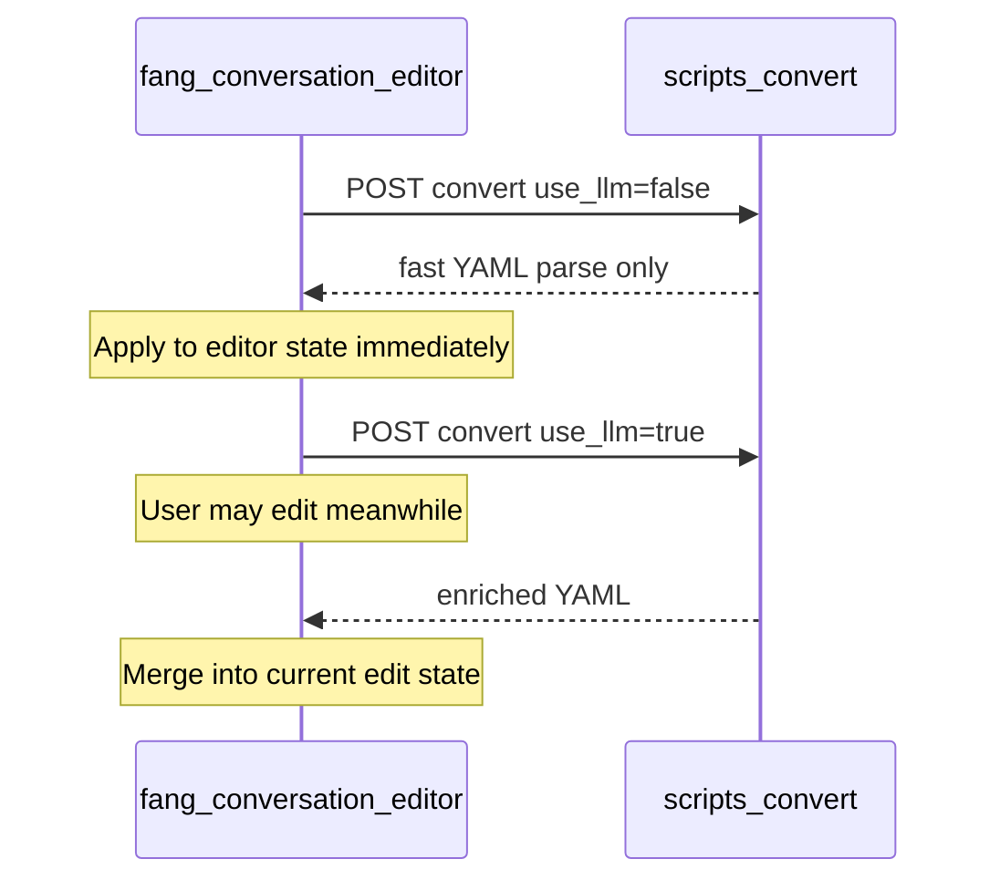

# Dual-path script convert — frontend follow-up

Backend work lives in `conversation-editor` and is **done**. Continue here in **fang-conversation-editor**.

## Backend contract (ready)

`POST /api/v1/editor/scripts/convert` body params:

| Param | Default | Behavior |
|-------|---------|----------|
| `text` | required | Script text |
| `use_llm` | **false** | Parse only (no Ollama). `true` → background detect + speaker categorize |

Response is **`text/yaml`** — same array-of-conversations shape for both paths. No merge metadata from the API.

**Backend merge rule (affects fast-path shape):** consecutive conversations are merged only when they share the same **non-empty** `background_url`. Blank/missing backgrounds stay separate, so `-*-` chunks from the fast path remain distinct conversations for the UI to map/merge against.

## Frontend work

### 1. API client

Wherever convert is called, accept/pass `use_llm` (default false to match backend).

### 2. Dual request

On convert:

1. Start `use_llm=false` and `use_llm=true` together (or start LLM right after kicking off fast).
2. When fast returns → load into the modifying editor state immediately.
3. Keep editing unlocked while LLM is in flight.
4. When LLM returns → merge into **current** state (not a blind replace of the fast snapshot if the user already edited).

Cancel/ignore stale LLM responses if the user converts again with different text.

### 3. Merge rules (implemented in `src/mergeLlmConvert.ts`)

Align chats by sequential content against the fast-path baseline:

- **FE delete** → stay deleted (BE cannot resurrect)
- **FE add** (typically `(...)`) → keep
- **FE splits** + **BE splits** → union of cut points on the chat stream
- **background_url**: FE if set, else BE
- **sprites / soundtrack / background_color / content**: always FE
- **role**: BE enrichment on content-matched chats

### 4. UX

Lightweight status: enriching… / enriched / enrich failed. Do not block the editor on the LLM request.

## Backend reference (completed in conversation-editor)

- Controller: `use_llm` boolean → service
- Service: `call(text, use_llm: false)`; LLM gated; blank backgrounds never consecutive-merged
- Docs: `docs/ARCHITECTURE.md`, skill endpoint bullet

## Out of scope here

- Changing YAML response shape or adding merge metadata headers
- Async job/streaming convert on the backend
- Parallelizing Ollama inside a single `use_llm=true` request
